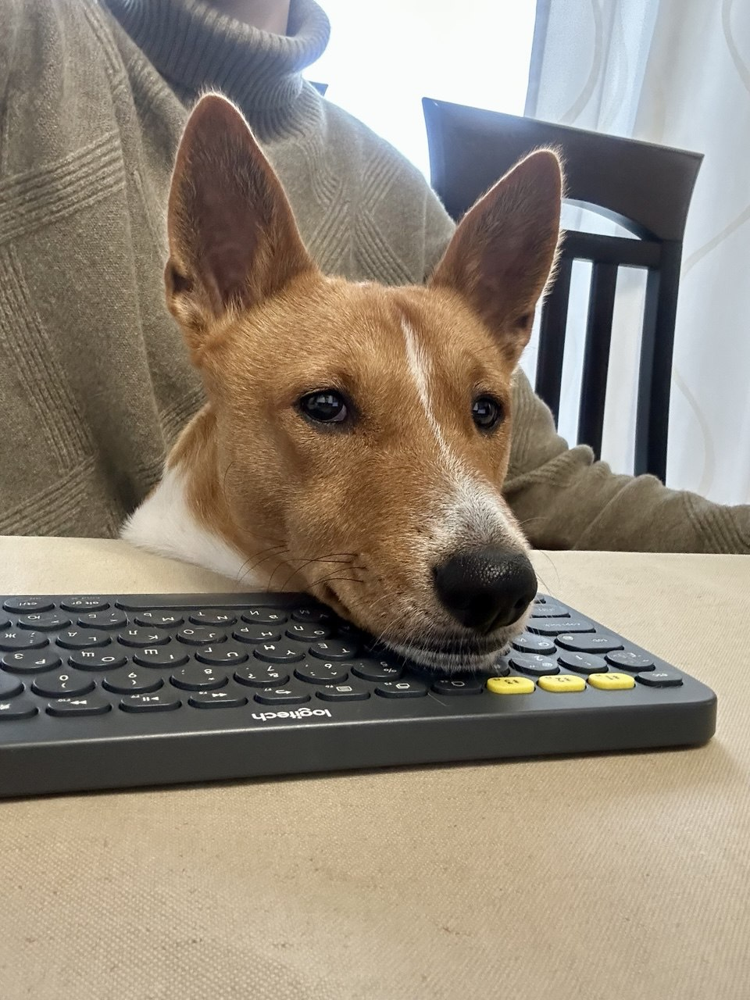

# Homework
```
Андронова Евгения
ВШЭ, 1 курс магистратуры, Ятбио 25/27 
```

| Дата | ДЗ | Статус | Коментарий | 
| ----------- | ----------- | ----------- | ----------- |
| 22.09.25    | Сделать репозиторий  | Выполнено | |
| 23.09.25    | Добавить readme.md в репозиторий| Выполнено | |

- Мои цели
  - Аналитика данных
  - NLP

P.S.: Фото моей собаки




